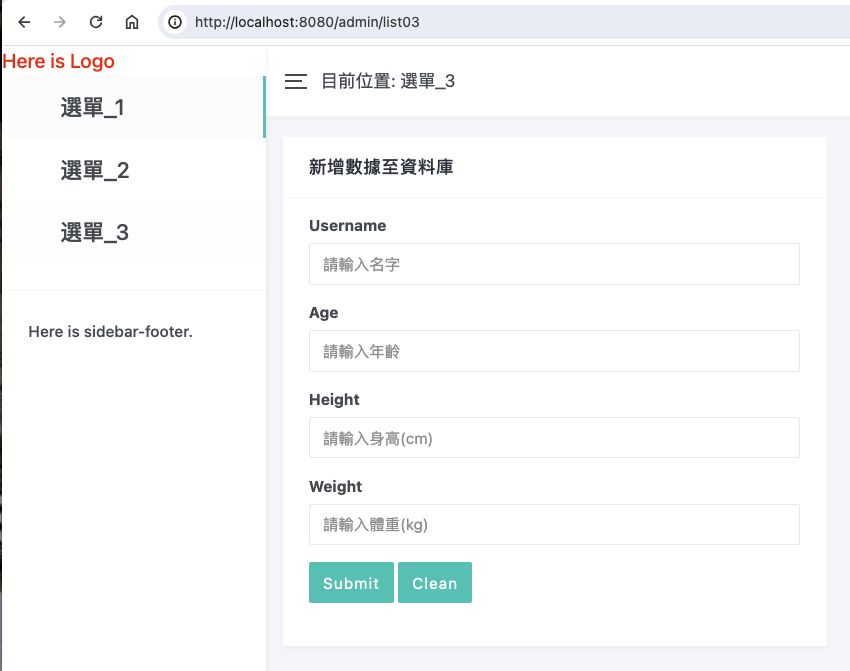

# **java_demo_01**

## **自學Java - 極簡化網頁展示**

#### **1. 目的：** 
經過半個月的時間自學 Java，希望藉由總結實作的程式碼來瞭解學習狀況，即知道目前可以掌握技術知識點。

#### **2. 使用相關框架或套件：**
Spring Boot、Thymeleaf、Spring JDBC、PostgreSQL、pgAdmin、Chart.js、Bootstrap…等。

#### **3. 簡介：** 
使用Spring Boot框架，將程式分成Controller、Service及Dao三層來負責不同的功能，由Spring JDBC操作資料庫PostgreSQL，實現API接口。另外，以Thymeleaf建立簡單後台管理網頁，套用Bootsrap設計樣版達成響應式網站，其中圖表以Chart.js繪製。最後，打包項目成 jar檔案，由Docker Compose佈署相關服務。部份頁面及說明如下：

(1)主頁面
- 此頁面之設計樣版參考網路作品，詳見「[筆下光年](<https://gitee.com/yinqi/Light-Year-Admin-Template>)」。

 

(2)點擊「選單_3-1」至接口 /chart 

- 從資料庫擷取數據，以Chart.js繪製出圓餅圖呈現於網頁。

(3)點擊「選單_3-2」至接口 /areasales 
- 從資料庫作聚合查詢，將結果展示於網頁。

(4)點擊「選單_3-3」至接口 /admin/list03 
- 將insert_db.html渲染成網頁，提供Form填寫新增數據，再提交post requst給接口 /inseruser，將數據寫入資料庫。

(5)接口 /area/{area} 
- 提供Path Variable作查詢。

